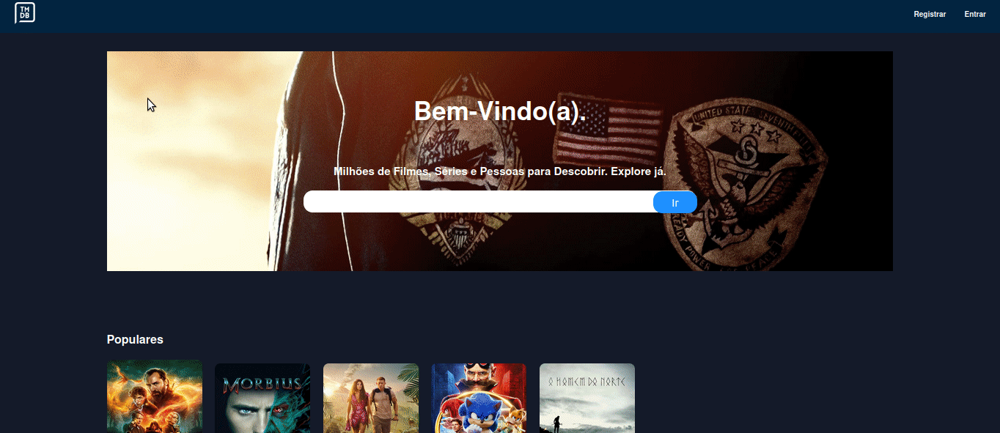
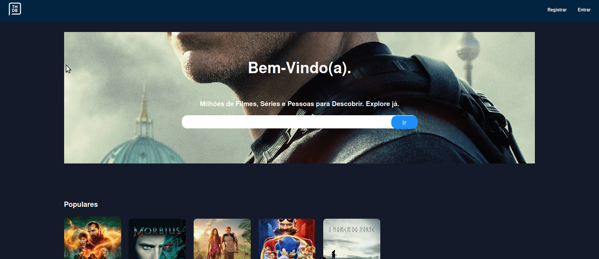
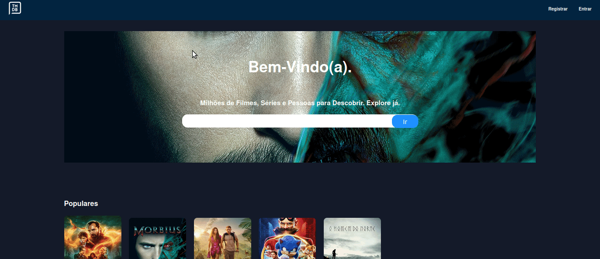

# Welcome to Remix The Movie Database App!

- [DEMO](https://remix-vercel-tmdb-rjb8vmp38-marcusjava.vercel.app/home)

- [Remix Docs](https://remix.run/docs)

## Tecnologias utilizadas

- Remix Run
- Firebase (Admin e Auth)
- Emotion
- Typescript

## Instruções de Instalação

1 - Clonar repositorio

`https://github.com/marcusjava/tmdb-remix`

2 - Criar projeto no [firebase](https://console.firebase.google.com/) e salvar as configurações no arquivo firebase.config.json na raiz da projeto

3 - Configurar o firebase-admin gerando arquivo de chave privada.

    - No console do firebase, abra <strong>Configurações</strong> >>> [Contas de Serviço](https://console.firebase.google.com/project/_/settings/serviceaccounts/adminsdk)
    - Clique em Gerar nova chave privada e selecione Gerar chave para confirmar.
    - Salvar com nome serviceAccount.json na raiz do projeto.

4 - Criar conta e obter chave de acesso à API do [TMDB](https://www.themoviedb.org)

    - Após efetuar login ir em CONFIGURAÇÕES >>> API e copiar a Chave da API (v3 auth)

5 - Criar arquivo .env com as seguintes variaveis

REACT_APP_MOVIEDB_API_KEY - Chave da API (v3 auth)
GOOGLE_APPLICATION_CREDENTIALS - caminho do arquivo serviceAccount.json Ex. "./serviceAccount.json"
SESSION_SECRET - palavra secreta para gerar o cookie de sessão

6 - Executar no terminal

```sh
npm install
npm run dev
```
